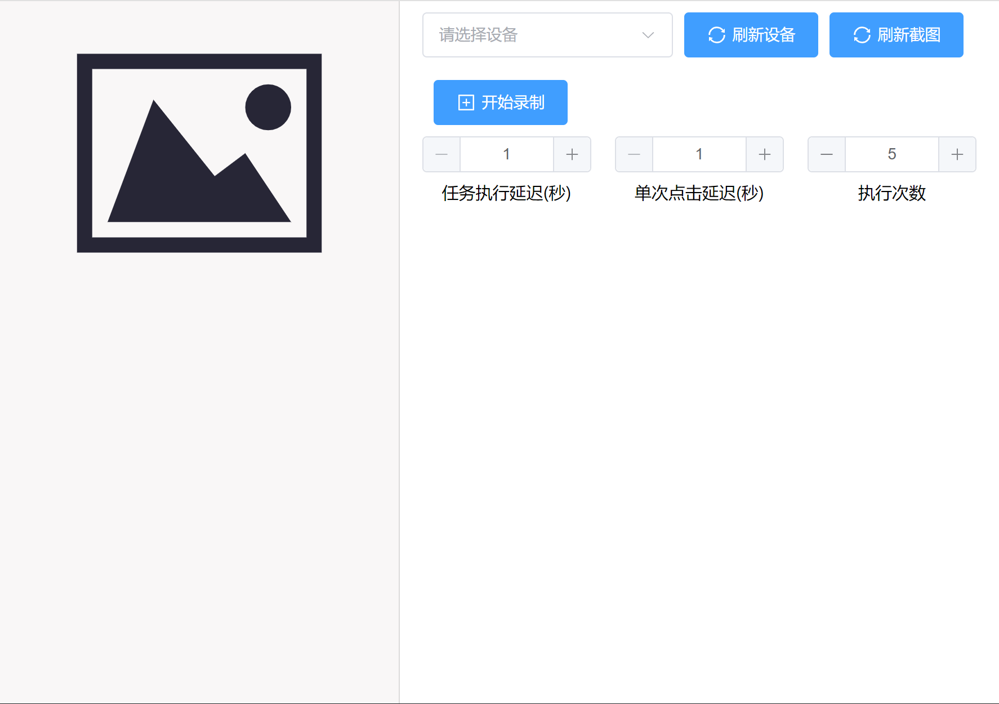
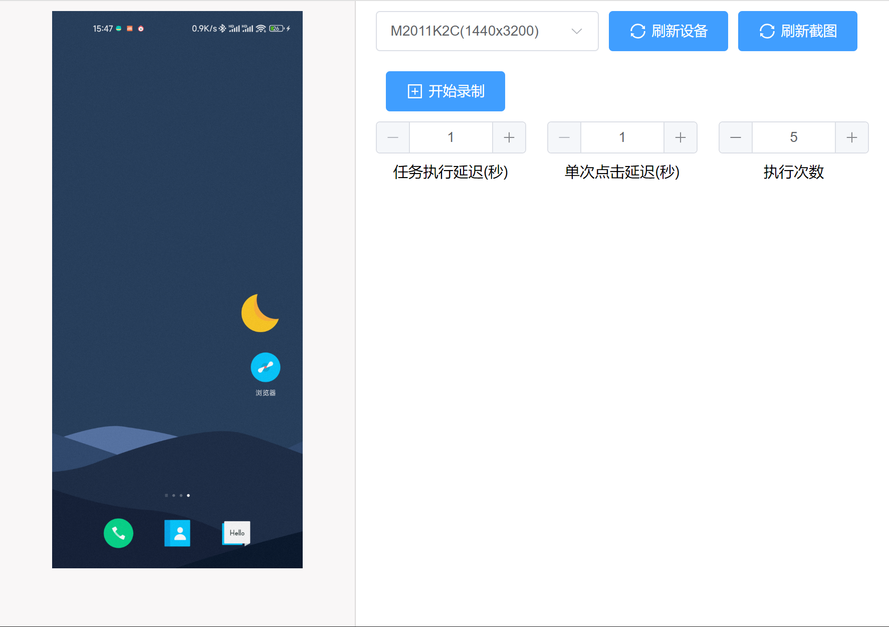
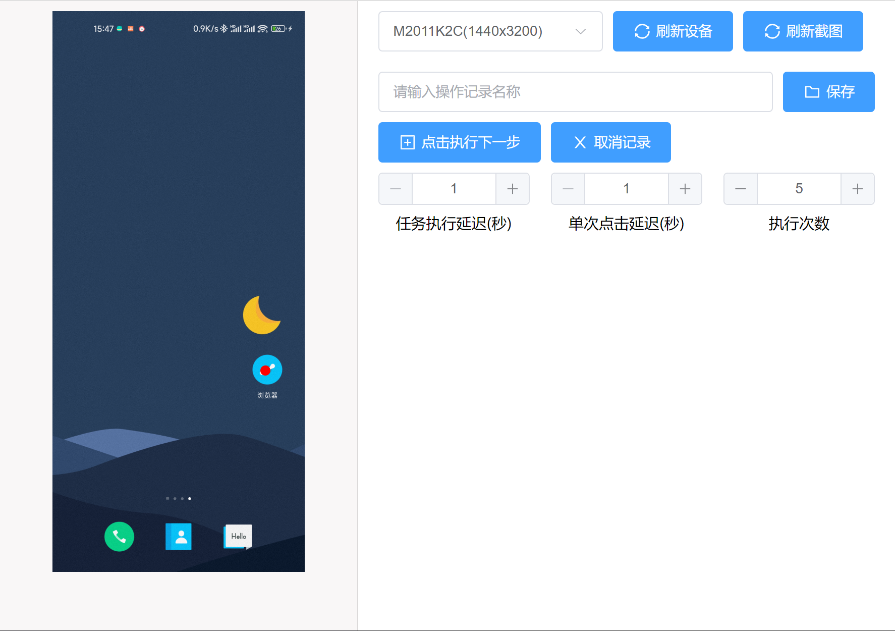
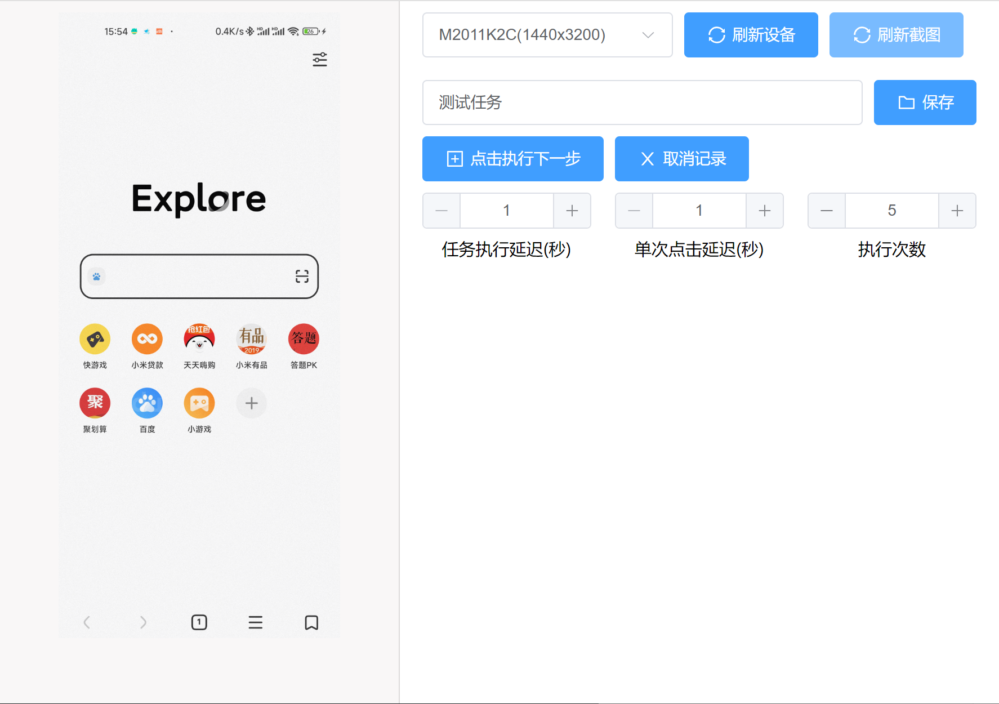
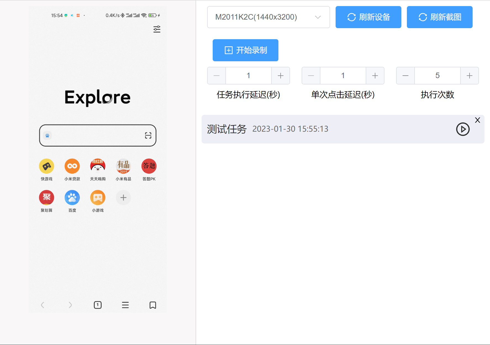
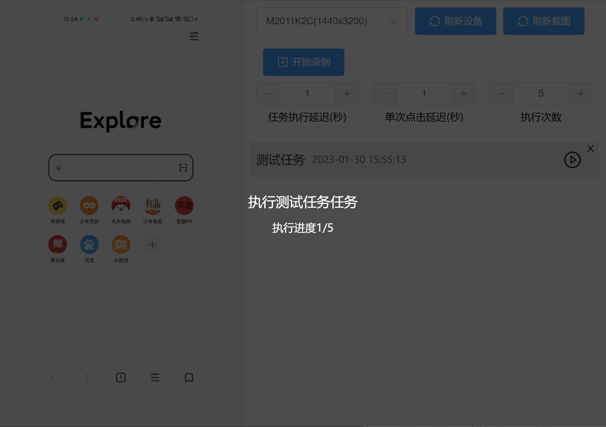

# 柴柴工具箱

> 使用 electron+vue3+adb 实现的一个手机模拟点击工具

## 如何使用

### 手机打开 usb 调试模式，设置允许模拟点击，连接到电脑

### 选择手机设备,可通过右侧按钮刷新设备，以及获取手机当前截图

-   初始状态

    

-   连接设备状态

    

### 创建任务

-   点击开始录制

    

-   点击右侧图片选中位置，执行下一步完成点击并记录到任务中

    

-   输入任务名称，点击保存

    

### 执行任务

-   设置好执行参数
-   点击执行任务

    

-   查看任务执行状态

    

-   当任务运行时点击遮罩可取消任务执行

## 升级规划

-   [ ] 实现长按滑动等输入方式
-   [ ] 优化 ADB 截图时间
